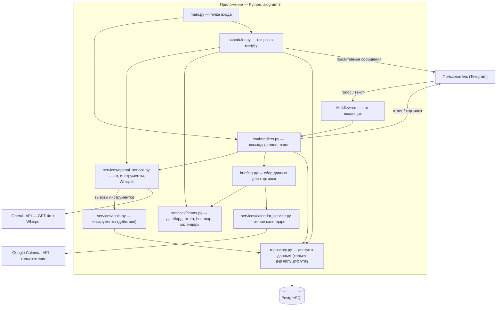
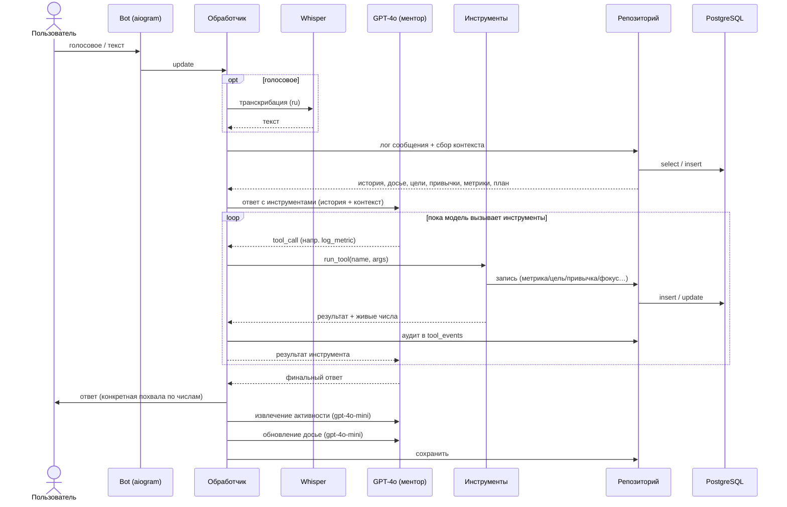
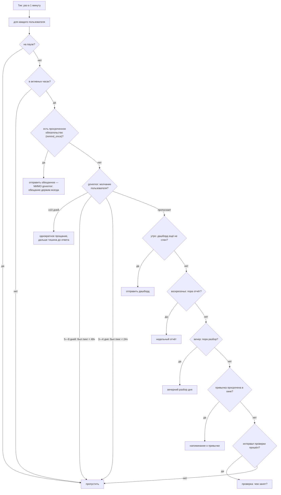
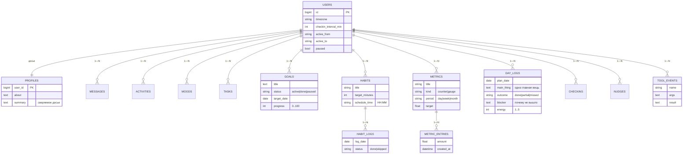
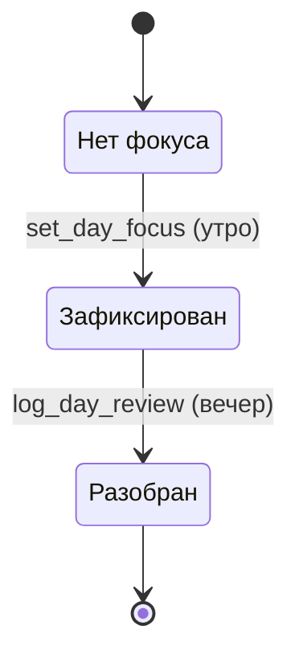
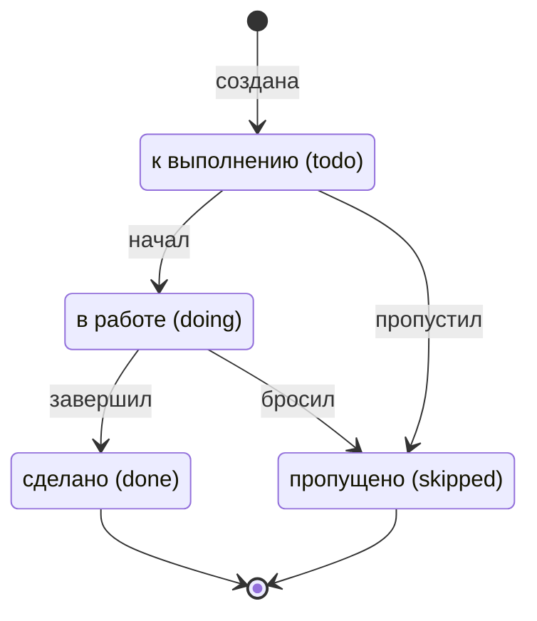
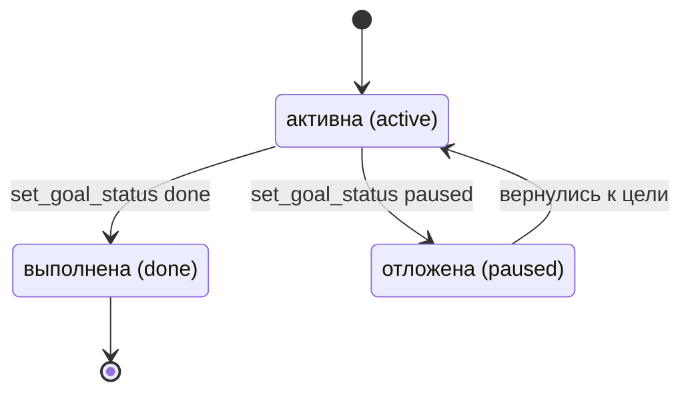
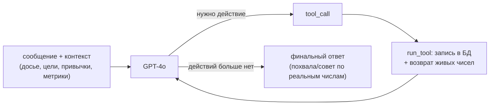

# Архитектура в диаграммах

Диаграммы того, как устроен проект и как модули работают между собой.
Все схемы — в формате **Mermaid** (текст в markdown).

> Как смотреть: в VS Code — расширение «Markdown Preview Mermaid Support»
> (или встроенный предпросмотр, если поддерживает Mermaid); на GitHub
> рендерится само; либо вставь блок в https://mermaid.live.

---

## 1. Модули и их связи

Как компоненты приложения взаимодействуют друг с другом и с внешними сервисами.

---

## 2. Поток обработки сообщения

Что происходит, когда приходит голосовое или текст — от расшифровки до ответа,
сохранения данных и обновления памяти.

---

## 3. Проактивный движок — что решает один тик планировщика

Раз в минуту для каждого пользователя. **Не больше одного** проактивного
сообщения за тик — приоритет сверху вниз.

**Тихий governor.** Чем дольше человек молчит, тем реже бот пишет первым:
до 3 дней — обычный ритм; 3—4 дня — не чаще 1 сообщения в сутки; 5—9 дней —
не чаще 1 сообщения в двое суток; с 10 дней — одно честное прощание
(«не буду писать первым, напиши когда захочешь») и полная тишина до ответа.
Любое входящее сообщение пользователя сбрасывает счётчик. Исключение —
обязательства из `remind_once`: то, что бот пообещал, он присылает всегда.

---

## 4. Модель данных

Таблицы и связи. Всё append-only: строки не удаляются, «удаление» — это смена
статуса.

---

## 5. Диаграммы состояний

### Ритуал дня (петля «обязательство → разбор»)

### Жизненный цикл задачи

### Жизненный цикл цели

---

## 6. Как «думает» наставник (петля инструментов)

Модель сама решает, какие действия выполнить, и подтверждает их человеку.

> Связанные документы: концепция и слабые места — `docs/concept.md`;
> правила и соглашения — `CLAUDE.md`.
