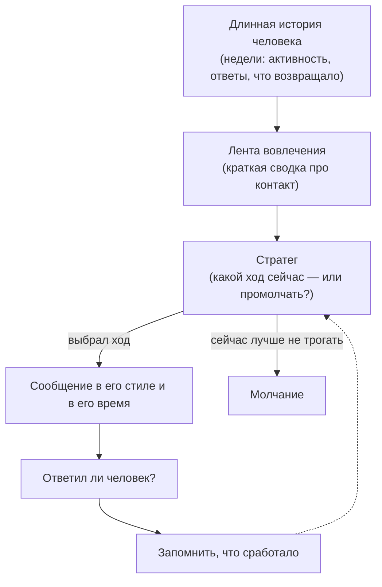

# Как бот находит контакт с человеком

*Простой план на будущее: как научить ассистента «пробиваться» к пользователю и
вовлекать его — особенно тех, кто притих. Записано 2026-06-05, чтобы прочитать и
потом взять в работу.*

---

## Проблема

Сейчас бот умеет писать сам (проверки, напоминания) и уже стал тактичнее: если его
игнорируют — он реже пишет и иногда шутит, чтобы вернуть внимание. Это хорошо. Но
по-настоящему **«находить контакт» он не умеет**:

- он видит только **последние ~20 сообщений** — это крошечное окошко; он не помнит,
  когда человек обычно на связи, что его возвращало раньше, как давно он молчит;
- у него по сути **одна тактика** на случай тишины (пошутить);
- он не **выбирает стратегию** под конкретного человека и не учится, что на него
  действует.

Получается: бот старается, но «вслепую».

## Идея: движок вовлечения

Сделать «вовлечение» **отдельной осознанной способностью** бота — маленьким
«стратегом», который:

1. **смотрит на длинную историю** человека (недели, а не 20 сообщений);
2. **решает**, стоит ли сейчас выходить на связь, и **каким ходом** — или лучше
   промолчать;
3. **смотрит на результат** (ответил ли человек) и **запоминает**, что работает
   именно для него.

То есть бот перестаёт пинговать вслепую и начинает осознанно подбирать ключик.

## Три опоры

**1. Лента вовлечения (длинный взгляд).**
Для каждого человека бот держит короткую «сводку про контакт»:
- когда он обычно активен (утро/вечер);
- отвечает ли на сообщения и как этот показатель меняется (становится молчаливее?);
- сколько прошло с последнего **живого** ответа;
- что возвращало его в прошлый раз (какая тактика сработала);
- какие темы его «зажигают».

Хорошая новость: всё это **уже хранится** в данных — нужно лишь собрать в сводку.

**2. Стратег (выбор хода).**
Не одна шутка, а набор тактик — и выбор под человека и момент:
- лёгкая шутка/юмор;
- любопытство, недосказанность;
- отсылка к прошлой победе («в прошлый раз ты добил 75 приседаний — повторим?»);
- привязка к его цели и к тому, «кто он»;
- **микро-просьба** («просто одно слово — как ты?»);
- искренняя проверка («давно не слышно, всё в порядке?»);
- написать **в его активное время**, а не наугад;
- **промолчать** — это тоже полноценный ход.

**3. Обучение.**
Бот замечает, какой ход вернул человека к разговору, и в следующий раз опирается на
это. Со временем подход подстраивается под конкретного человека.

## Принципы (без них будет вред)

- **Цель — живой отклик и польза человеку, а не «побольше сообщений».** Самый
  быстрый способ получить блокировку — назойливость.
- **Молчание — нормальная стратегия.** Иногда лучший ход — не трогать.
- **Жёсткие ограничители — в надёжной части (в коде):** частота, активные часы,
  «замолчать, если игнорируют», «остановиться, если заблокировали».
- **Этика:** вовлекать — ради **его** целей, а не ради «времени в приложении».
  Нянька заботится о человеке, а не о метрике. Эту грань не переходим.

## Что уже есть (кирпичики)

Кое-что уже работает и встроится в этот движок:
- бот **реже пишет**, когда его игнорируют (backoff), и **шутит**, чтобы вернуть;
- он умеет понимать **когда человек активен** (ритм);
- он умеет **подводить итоги и подстраивать подход** (недельная рефлексия).

Движок вовлечения это объединяет и доводит до ума.

## Как это устроено — одна простая схема

## С чего начнём

1. **Лента вовлечения** — собрать длинную сводку про контакт с человеком (это чинит
   «слепоту 20 сообщений» и сразу полезно само по себе).
2. **Стратег** — поверх ленты: выбор хода или молчание.
3. **Обучение** — что сработало, запоминаем и подстраиваемся.

Начать стоит с **ленты вовлечения** — это фундамент, на котором держится всё
остальное.
