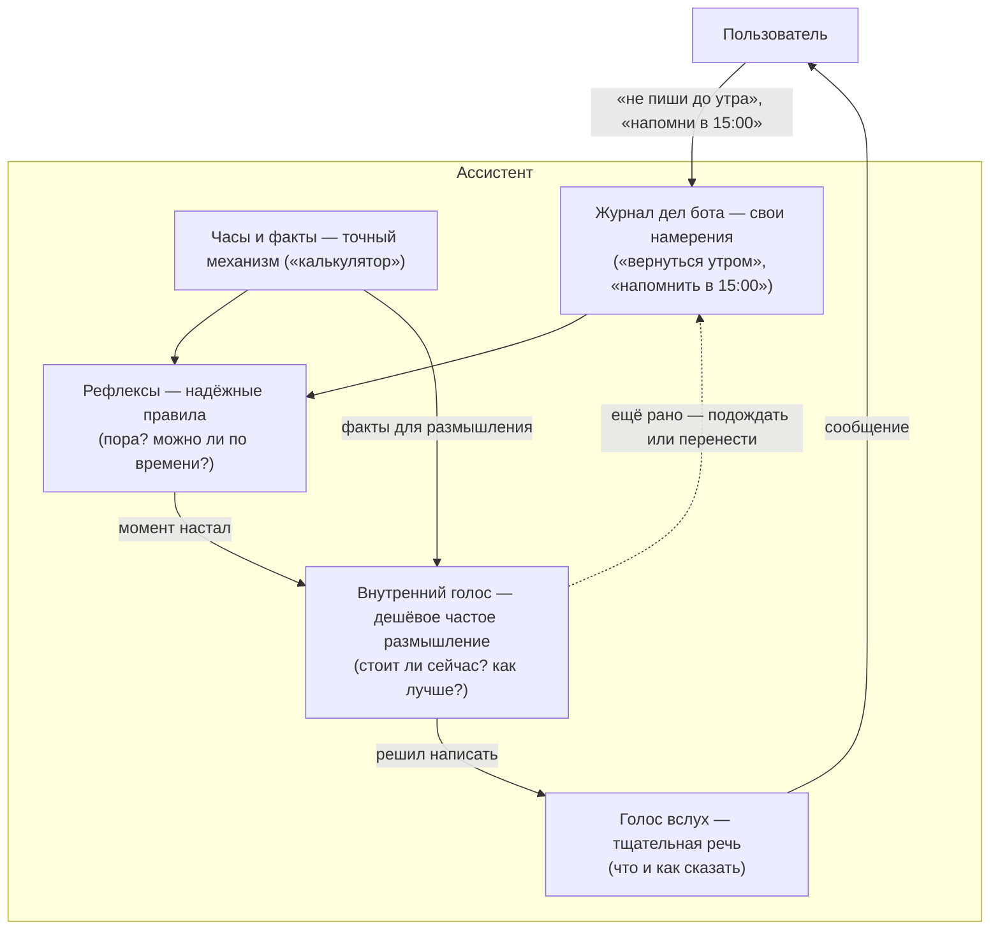
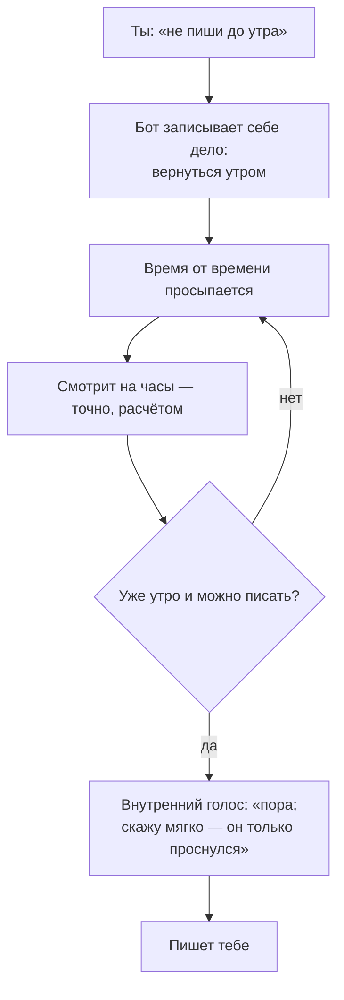

# Бот, который думает

*Рассказ о том, куда мы ведём этого ассистента. Без техники — просто история и
идея. Записано 2026-06-02 по следам разговора.*

---

## С чего всё началось

Однажды вечером человек сказал своему ассистенту: «Я ложусь спать, не пиши мне до
утра». Ассистент вежливо ответил: «Хорошо, не буду беспокоить». И… замолчал.
Не до утра — а на полтора дня.

Почему так вышло? Потому что внутри у него была только одна простая кнопка:
«молчать» или «говорить». Он услышал «не пиши» и нажал «молчать». А вот мысли
«надо снова заговорить утром» у него не было. Некому было её хранить, некому было
вспомнить. Кнопка осталась нажатой.

Этот маленький случай оказался очень важным. Он показал, чего ассистенту
по-настоящему не хватает.

## Чего ему не хватает: своих собственных дел

Представь обычного хорошего помощника — человека. Когда ему говорят «не тревожь
меня до утра», он не «выключается». Он **запоминает это как своё дело**: «утром
вернуться к разговору». И в течение дня нет-нет да и поглядывает: «А сейчас сколько?
Уже утро? Человек проснулся? Ага, можно — напишу».

Вот этого внутреннего блокнота у нашего ассистента и не было. Идея простая и
красивая: **у бота должны быть свои дела**. Не только наши задачи, которые он
помогает нам не забыть, — но и его собственные обязательства перед самим собой:
- «вернуться к человеку утром»,
- «через два часа спросить, как продвигается»,
- «завтра напомнить про документы».

Он записывает их себе, время от времени просыпается, смотрит на часы — и сам
решает, наступил ли нужный момент. Тогда «до утра» снова станет именно «до утра»,
а не «навсегда».

## Следующий шаг: дать ему внутренний голос

Дальше мысль пошла глубже. Если у бота есть свои дела, то хорошо бы, чтобы он умел
**рассуждать** над ними — тихо, про себя. Не просто «время пришло — отправить», а
по-человечески: «Так, прошло двенадцать часов, сейчас девять утра, человек обычно с
девяти на связи… значит, можно. Хорошо, напишу — и, пожалуй, мягко, он только
проснулся».

Это и есть **внутренний голос** — то, что у нас в голове проговаривается само
собой, прежде чем мы что-то скажем вслух.

И тут возникла изящная идея. У человека ведь два режима мышления. Один — быстрый и
дешёвый: им мы прикидываем, взвешиваем, бубним себе под нос целый день, почти не
уставая. Другой — медленный и тщательный: его мы включаем, когда нужно сказать
что-то важное и подобрать слова.

Так же можно устроить и бота:
- **внутренний голос** — пусть будет «лёгким и дешёвым». Им бот может думать часто,
  прикидывать «а уместно ли сейчас», «что из дел важнее» — и это не разорительно;
- **голос вслух** — пусть будет «тщательным». Его бот включает реже: когда
  действительно обращается к тебе, чтобы сказать по-человечески и по делу.

Тогда получается ассистент, у которого есть **внутренняя жизнь**: он что-то держит
в уме, прикидывает, замечает — и выходит на связь не потому, что ты первый написал,
а потому, что сам решил, что сейчас — подходящий момент.

## Но с одной важной оговоркой — честность

Здесь легко споткнуться, и мы это уже проходили. Был случай, когда бот «прикинул»
и заявил, что проект готов на 51% — взяв число буквально из воздуха. И другой —
когда он спутал «19:26» (время) с «19 лет» (возраст).

Урок простой: **думать и считать — разные вещи**. Лёгкому внутреннему голосу можно
доверить *суждение* («стоит ли сейчас писать», «как лучше сказать»), но нельзя
доверять *твёрдые факты* — время, цифры, «сколько прошло», «выполнено ли». Факты
должен считать точный, надёжный механизм — как калькулятор. А голос — рассуждать
**поверх** этих фактов, а не выдумывать их.

Так бот остаётся одновременно живым и честным. Это и есть его суть, к которой мы
всё время возвращаемся: **заботиться, но проверять**. Он поддержит и подтолкнёт —
но не соврёт и не подгонит цифры, и всё, что он «сделал», он сделал на самом деле,
а не на словах.

## Зачем всё это

Чтобы превратить ассистента из того, кто **отвечает**, когда к нему обратились, — в
того, кто **сам присутствует** в твоей жизни. Который помнит свои обещания, ловит
правильный момент, тихо думает о тебе в фоне и выходит на связь, когда это
действительно к месту. Не назойливый таймер — а внимательная «нянька», которая и
позаботится, и спросит, и вовремя вернётся к разговору.

Самое приятное: это не фантастика и не дорого. Лёгкий внутренний голос как раз
делает такое «думание» доступным. Нужно лишь собрать его правильно — дать боту
блокнот своих дел, научить поглядывать на часы и рассуждать поверх честных фактов.

## Как это устроено — на двух простых схемах

Если хочется увидеть идею одной картинкой — вот две схемы. *(Это «живые»
диаграммы: на GitHub или в редакторе с поддержкой Mermaid они нарисуются сами; в
обычном тексте видно их описание.)*

**Схема 1. Три «слоя» бота и как они работают вместе.** Часы и журнал дел — это
память и факты. Рефлексы (надёжные правила) решают «пора ли». Внутренний голос
(дешёвый, думает часто) прикидывает «стоит ли и как». Голос вслух (тщательный)
уже говорит с тобой.

**Схема 2. История «не пиши до утра» по шагам.** Бот не «выключается», а
записывает себе дело и время от времени проверяет часы — пока не наступит нужный
момент.

---

Это и есть направление, в котором мы идём.
